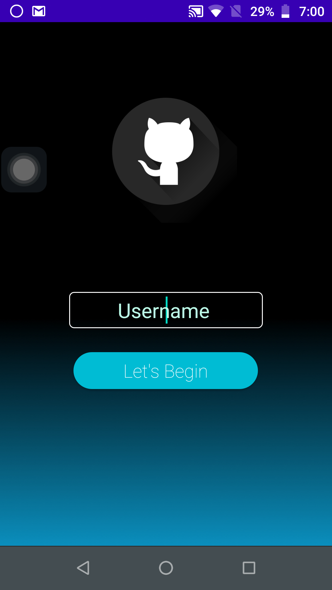
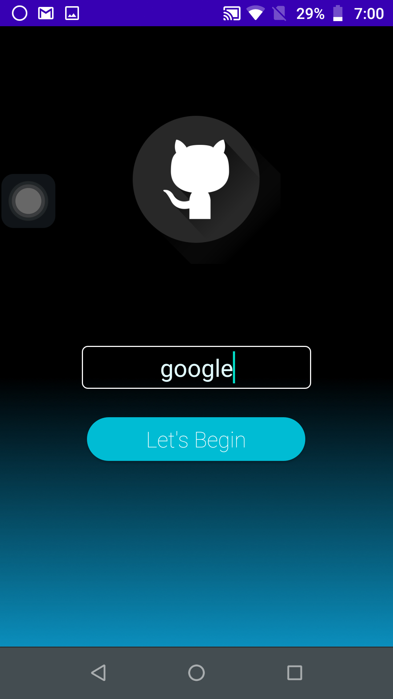
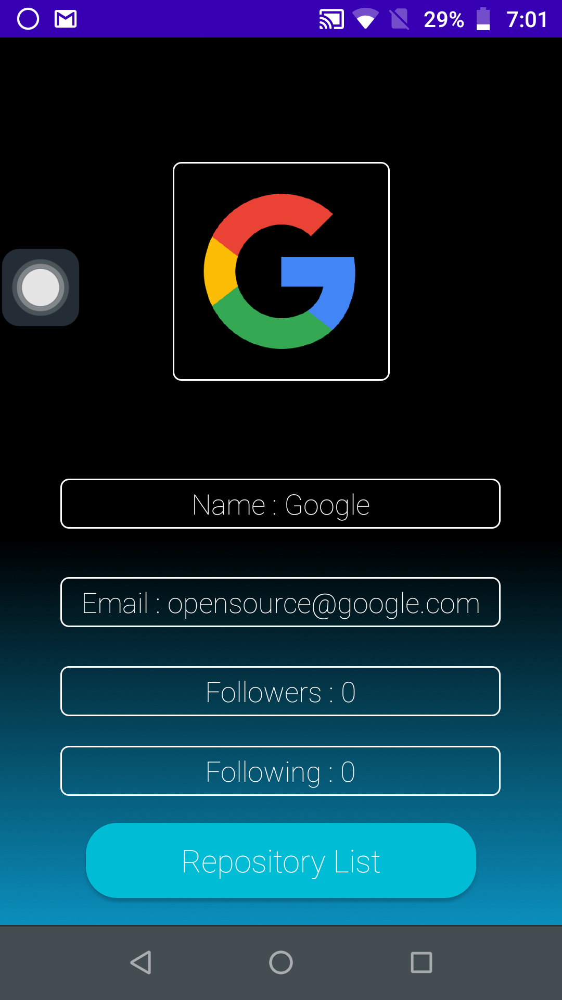
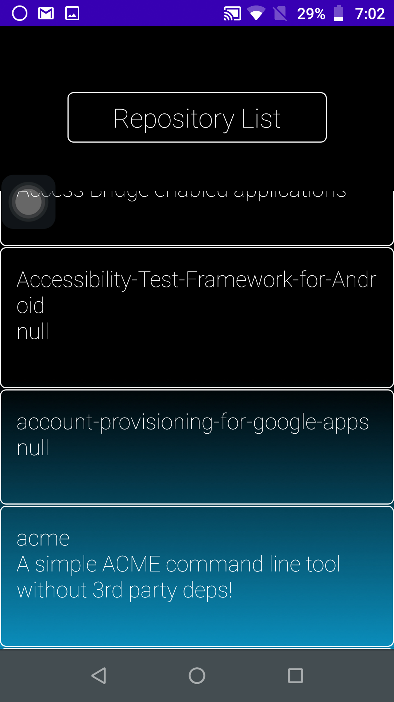
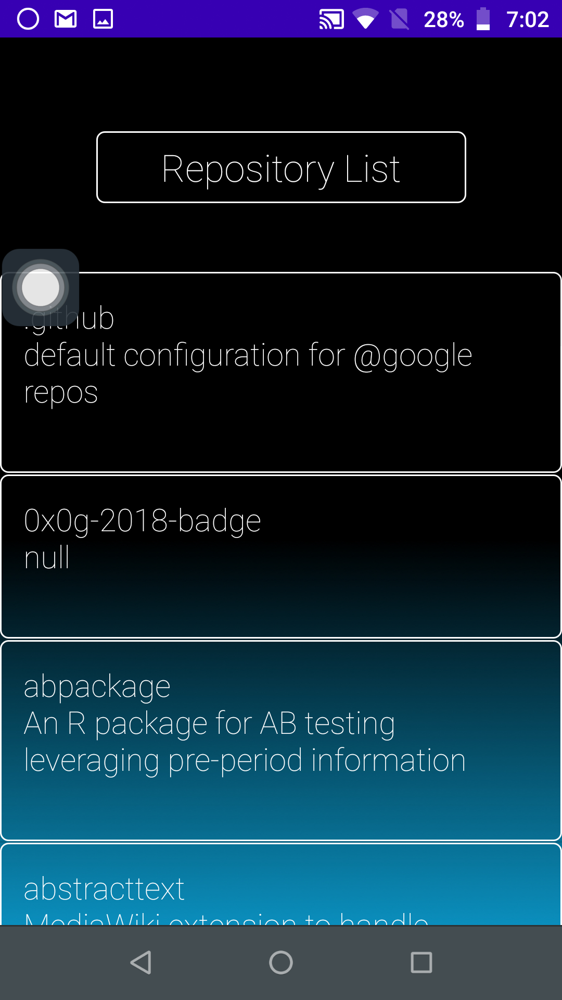

# Github Stalker

A simple app to gather information about a Github user's details and respective repositories using the Github API. This project uses Retrofit library for networking.

---
# Features 
- Downloads all the content using the github API.
- Click to open repository in web browser.
- Uses Lottie animation.

---
# Screenshots
      

